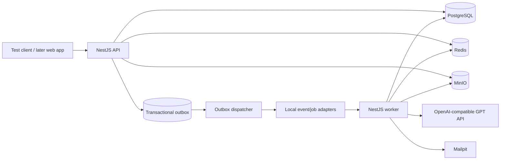
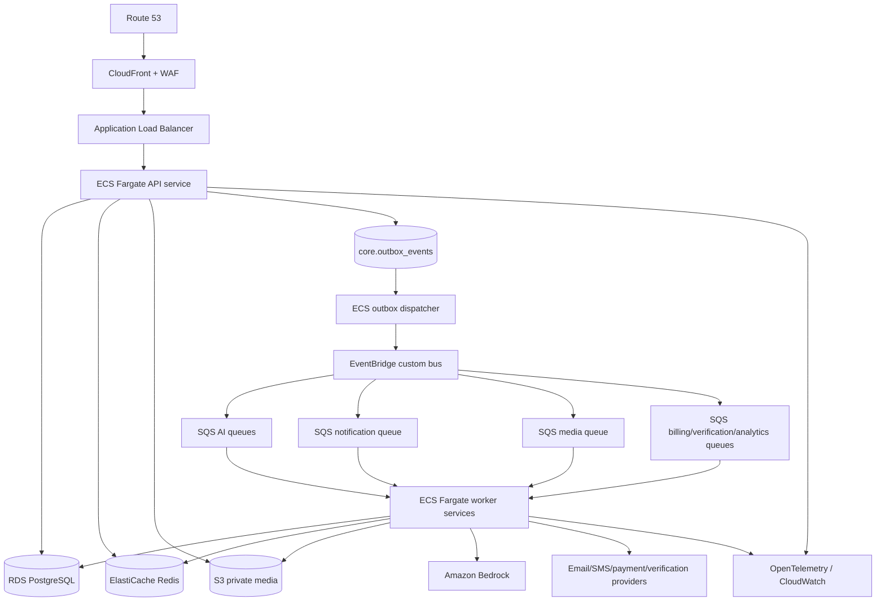

# Component catalog and architecture

## 1. Architectural style

Use a **modular monolith** with two runtime entry points:

- **API runtime:** synchronous REST, OpenAPI, authentication, authorization, and WebSocket connections.
- **Worker runtime:** asynchronous AI, media, notification, billing, verification, analytics, and event-dispatch work.

Both are built from one repository and share versioned module contracts. Worker types may run as independently scaled ECS services from the same image or build artifact. Business modules are not independent network services at the 1,000-user stage.

## 2. Recommended implementation stack

| Concern | Baseline |
|---|---|
| Language/runtime | TypeScript on a pinned active Node.js LTS release |
| Backend framework | NestJS modular application |
| Package/workspace | `pnpm` workspace |
| API style | REST `/v1`, OpenAPI 3.1, RFC 9457 problem details |
| Realtime | WebSocket through the ALB; REST remains authoritative fallback |
| Database | PostgreSQL 16+ on local Docker/RDS |
| Data access | Prisma migrations/client, with reviewed SQL for advanced indexes and constraints |
| Cache/rate limits/local jobs | Redis; BullMQ behind queue interfaces for local development |
| AWS events/jobs | Transactional outbox → EventBridge → SQS → worker; DLQ per queue |
| Media | S3 in AWS; S3-compatible MinIO locally; presigned upload/download |
| AI | Domain capability interfaces with OpenAI-compatible and Bedrock adapters |
| Validation | Request DTO validation plus JSON Schema for AI/event structured outputs |
| Observability | OpenTelemetry, structured logs, CloudWatch metrics/alarms |
| Infrastructure | Terraform, Docker, ECR, ECS Fargate, GitHub Actions with OIDC |
| Testing | Unit, PostgreSQL/Redis integration, API contract, end-to-end, AI evaluation, load, and security tests |

The stack is a concrete default so work can be decomposed. Change it through the decision register before repository scaffolding.

## 3. Context topology

### Local development



### AWS production



CloudFront behaviors must not cache private API or media responses. Private media uses short-lived signed access after authorization.

## 4. Runtime components

| Component | Responsibility | State ownership | Scaling signal |
|---|---|---|---|
| API service | REST, WebSocket, auth context, validation, orchestration | No local durable state | CPU, memory, request count, latency, connections |
| Outbox dispatcher | Claims committed outbox rows and publishes events | Outbox lease/checkpoint | Unpublished row age/count |
| AI worker | Profile, compatibility, search, communication AI jobs | AI request/result tables | SQS queue depth and oldest age |
| Notification worker | Templates, preferences, channel delivery | Notification/delivery tables | Queue depth/provider rate limits |
| Media worker | Malware scan, metadata removal, thumbnails, moderation | Media asset state | Queue depth/process duration |
| Verification worker | Provider polling/webhooks and review transitions | Verification tables | Queue depth/pending age |
| Billing worker | Signed webhook normalization and entitlement updates | Billing tables | Queue depth/webhook lag |
| Analytics projector | Builds product events and aggregate metrics | Analytics tables | Event lag |
| Scheduler | Enqueues reminders, expiry, cleanup, retry, and digest jobs | Scheduled job leases | Due-job lag |
| PostgreSQL | Authoritative transactional data and outbox | Durable relational state | CPU, connections, IOPS, storage, slow queries |
| Redis | Cache, distributed rate limits, ephemeral presence, local queues | Disposable/replicable state | Memory, evictions, connection count |
| Object storage | Photos, documents, generated biodata, exports | Versioned encrypted objects | Storage/request/errors |

## 5. Business modules

Modules expose application services and versioned contracts. Controllers, queue handlers, and provider adapters call these services; they do not implement business rules.

| Module | Owns | Must not own |
|---|---|---|
| Network & Brand | Networks, brands, domains, experiences, localization/config resolution | Candidate identity or match policy |
| Identity & Access | Accounts, credentials, sessions, MFA, roles, invitations, consents | Profile facts or billing entitlements |
| Profile | Candidate record, managers, profile sections, family, preferences, publication/completeness | Search result ranking or raw files |
| Reference Data | Countries, languages, communities, education, occupations, interests | User selections |
| Media | Upload grants, object metadata, processing states, access policy | Profile publication rules |
| Discovery | Search specification, policy filtering, saved searches, views, shortlist | Interest state transitions |
| Matchmaking | Compatibility inputs, interests, match lifecycle, match feedback | LLM provider calls or message bodies |
| Messaging | Conversations, participants, messages, receipts, realtime fan-out | Moderation adjudication or payment state |
| Trust & Safety | Blocks, reports, risk signals, moderation cases/actions/appeals | Authentication credentials |
| Verification | Check definitions, provider sessions, evidence references, verified claims | Public raw evidence exposure |
| AI Orchestration | Capability jobs, prompt/model policy, provider routing, structured outputs, feedback/evaluation | Authoritative profile mutations without confirmation |
| Notification | User preferences, templates, notifications, delivery attempts | Business-event decisions |
| Billing & Entitlements | Plans, prices, checkout references, subscriptions, transactions, entitlement checks | Card data |
| Admin & Support | Audited operations, queues, notes, support/data-rights workflows | Bypassing module authorization |
| Analytics | Minimized product events, projections, operational/business metrics | Transactional source-of-truth behavior |
| Audit & Compliance | Immutable security/admin audit, export/deletion workflow evidence | General application logging |

## 6. Cross-cutting platform components

- Configuration validation and typed environment loading.
- Request ID, trace ID, actor, network, brand, locale, and authorization context.
- Authentication guards and capability-based authorization policies.
- Transaction manager, repository interfaces, and migration runner.
- Transactional outbox writer and inbox/idempotency guard.
- Cache abstraction with safe key namespacing and explicit TTLs.
- Rate limiting by IP, account, action, and network.
- Provider abstractions for email, SMS/WhatsApp, payment, verification, storage, malware scanning, moderation, and AI.
- Structured redacted logging, traces, metrics, health/readiness checks, and audit writer.
- Clock, ID, encryption, hashing, token, and feature-flag interfaces to make behavior testable.

## 7. Repository layout

```text
apps/
  api/                    # REST/WebSocket bootstrap and transport adapters
  worker/                 # queue consumers, scheduler, outbox dispatcher
packages/
  modules/
    network-brand/
    identity-access/
    profile/
    reference-data/
    media/
    discovery/
    matchmaking/
    messaging/
    trust-safety/
    verification/
    ai-orchestration/
    notification/
    billing-entitlements/
    admin-support/
    analytics/
    audit-compliance/
  contracts/              # OpenAPI DTOs, event schemas, shared IDs/errors
  platform/               # DB, auth, queues, storage, providers, telemetry
  test-support/           # factories, fixtures, containers, fake providers
prisma/
  schema.prisma
  migrations/
infra/
  terraform/
    modules/
    environments/dev/
    environments/staging/
    environments/prod/
docs-or-generated/
  openapi/                # generated artifact, not a replacement for documents/
scripts/
tests/
  e2e/
  load/
  ai-evals/
```

## 8. Dependency rules

1. Domain code imports neither NestJS, Prisma, AWS SDKs, nor AI provider SDKs.
2. A module changes another module only through an application service or a domain event—not by writing its tables.
3. Cross-module synchronous calls must be acyclic and limited to behavior required for the current response.
4. Database transactions may span modules only through an explicit application use case; emitted events join the same transaction through the outbox.
5. Event consumers assume at-least-once delivery and are idempotent.
6. API and event DTOs are versioned contracts, separate from persistence models.
7. `network_id` is resolved from trusted host/auth context, never accepted blindly from request JSON.
8. AI output is untrusted input: schema-validate, policy-check, ground against source facts, and require confirmation where it changes a profile or sends text.
9. Provider failures cannot corrupt core state; long work runs after commit and exposes a recoverable status.
10. Admin actions call the same domain services with stricter authorization and complete audit trails.

Automated architecture tests should prevent forbidden imports and direct cross-module repository access.

## 9. Synchronous versus asynchronous behavior

### Synchronous

- Register/login/refresh/logout.
- Resolve public brand configuration.
- Read or update profile sections and preferences.
- Request an upload URL and confirm upload metadata.
- Search already indexed/structured profile data.
- View profiles, shortlist/hide, send/respond to an interest.
- Send a message after fast policy validation and durable write.
- Create checkout/session references.
- Block/report and retrieve current state.

### Asynchronous

- Email/SMS/WhatsApp delivery.
- Media malware scan, metadata stripping, thumbnailing, and image moderation.
- AI extraction, bio, quality, compatibility explanations, search parsing, translation, and message drafts.
- Search projection refresh or recommendation refresh.
- Verification provider calls and polling.
- Billing webhook processing after signature capture.
- Analytics projections, digests, reminders, cleanup, data exports, and deletion workflows.

An asynchronous API returns `202 Accepted`, a stable operation ID, status URL, and optional real-time notification. Core state must still be usable if an AI/provider job fails.

## 10. Key interaction flows

### Profile update and AI refresh

1. API validates authorization and profile version.
2. One transaction updates the profile and appends `profile.updated.v1` to the outbox.
3. API returns the new profile version immediately.
4. Dispatcher publishes the event.
5. EventBridge routes durable jobs to AI, discovery, and analytics queues.
6. Workers claim jobs idempotently, write version-bound results, and emit completion/failure events.
7. WebSocket/notification tells the client that refreshed artifacts are available.
8. A stale result targeting an older profile version is retained for audit but never promoted as current.

### Interest acceptance

1. Recipient accepts a pending interest under row lock/optimistic constraint.
2. Transaction changes interest state, creates one canonical match, creates authorized conversation participants, and writes events.
3. Duplicate retries return the existing result.
4. Notification delivery happens after commit.

### Message send

1. API confirms active match/conversation, participant status, block state, rate limit, size, and attachment readiness.
2. Fast deterministic safety checks run before commit; policy may reject or quarantine.
3. Message is stored and event appended atomically.
4. API acknowledges with the authoritative message ID.
5. Realtime fan-out and notification happen asynchronously.
6. Deeper moderation can quarantine later according to published policy and create a human review case.

## 11. Scale path

### 1,000 users

- One codebase; one RDS PostgreSQL instance; one Redis deployment.
- Development/staging may use one API task; production should normally use two small API tasks across availability zones.
- Worker services start at zero/one where queue latency permits and autoscale by queue depth.
- PostgreSQL indexes and keyset pagination; no OpenSearch.
- One event bus and dedicated SQS queues with DLQs.

### Growth triggers—not calendar dates

- Add read replicas only when measured read load or reporting affects transactions.
- Add OpenSearch only when PostgreSQL search misses documented relevance/latency targets.
- Extract a module only when independent scaling, deployment cadence, ownership, or failure isolation outweighs distributed-system cost.
- Introduce a dedicated realtime tier only when WebSocket load materially competes with API traffic.
- Partition high-volume audit/message/event tables only after measured growth and retention requirements justify it.

## 12. Resilience rules

- Timeouts on every network call; bounded retries with jitter only for safe/idempotent operations.
- Circuit breakers and provider fallback where correctness permits.
- Database connection limits sized below RDS capacity; use pooling.
- No request waits for email, AI, thumbnailing, analytics, or external verification completion.
- Per-queue DLQ, replay tooling, age alarms, and poison-message quarantine.
- S3 object lifecycle/versioning, RDS point-in-time recovery, tested restore, and IaC recreation.
- Graceful shutdown stops accepting traffic, drains requests, releases queue leases, and closes telemetry.
- Feature flags and kill switches for AI capabilities, messaging attachments, provider channels, and new ranking versions.
