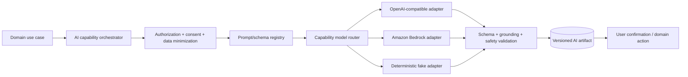
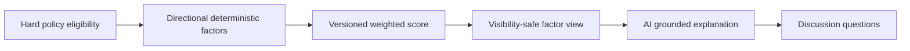

# AI architecture and evaluation

## 1. Principles

- AI is an optional, replaceable capability layer. Core profile, search, interest, match, chat, safety, and billing behavior remains correct when every model provider is unavailable.
- Local development uses an OpenAI-compatible GPT adapter or deterministic fake adapter. AWS production uses Amazon Bedrock through the same interfaces.
- Domain code asks for a capability, not a provider model name.
- Model output is untrusted. Validate JSON schema, grounding, policy, authorization, subject version, and output limits before storage or display.
- AI creates drafts and explanations. It does not silently modify profiles, send messages, verify facts, infer identity, impose sanctions, or decide whom a person should marry.
- Compatibility numbers come from deterministic versioned logic. An LLM explains existing visible factors; it does not generate or alter the score.
- Collect and send the minimum data required for a capability. Never include raw identity documents, contact values, secrets, hidden preferences of another profile, or unrelated conversations.
- Every production output is traceable to capability, prompt version, model route, source versions, safety policy, latency, and cost metadata.

## 2. Capability roadmap

### Launch capabilities

| Capability key | Input | Output | Intelligence/cost tier | User control |
|---|---|---|---|---|
| `profile.extract` | User-supplied onboarding text plus allowed reference options | Proposed structured field patch with confidence/evidence spans | Balanced | Review field-by-field; explicit apply |
| `profile.bio.generate` | User-authorized structured facts and requested tone/locale | 2–3 bio drafts | Balanced | Preview/edit/accept |
| `profile.quality.analyze` | Completeness projection and approved public draft | Suggestions and clarity/safety flags | Balanced/low | Advisory only |
| `compatibility.explain` | Deterministic visible factors and score | Grounded strengths, potential discussion areas, questions | Strong reasoning | View/rate; cannot change score |
| `search.parse` | User's natural-language query and allowed filter schema | Editable structured filter draft | Balanced | Confirm before search |
| `communication.draft` | Explicit intent, tone, locale, and authorized context | Introduction/reply/follow-up/rejection draft | Balanced | Edit and manually send |
| `communication.translate` | Explicit selected text and language pair | Translation plus uncertainty flags | Balanced | Preview; original retained |
| `communication.tone-check` | Unsent user text | Respect/safety/clarity suggestions | Low/balanced | Advisory only |

The deterministic profile completeness score is not an LLM output. AI may add suggestions around it.

### Growth capabilities

- Trust-summary explanation after policy and fairness review.
- Duplicate/copy/spam/risk signals with human moderation.
- Behavioral recommendation ranking with consent and offline evaluation.
- Family compatibility using explicitly shared family facts.
- Intelligent notification timing and copy with channel consent.
- Embeddings and semantic retrieval if measured relevance requires them.

### Later capabilities

- Family knowledge graph.
- Parent assistant grounded only in approved content.
- Voice interface/transcription.
- Relationship insights or success-pattern research with explicit governance.
- Wedding planning assistant/marketplace.
- Admin analytics narratives.

“Success prediction” must not ship as an individual probability unless legal, ethical, scientific-validity, and harm reviews approve it. A confident-looking model score is not evidence of a successful marriage.

## 3. Logical design



### Required interfaces

```ts
interface AiCapabilityGateway {
  request<TInput, TOutput>(request: CapabilityRequest<TInput>): Promise<CapabilityResult<TOutput>>;
}

interface ModelProvider {
  generateStructured(request: StructuredGenerationRequest): Promise<StructuredGenerationResponse>;
  embed?(request: EmbeddingRequest): Promise<EmbeddingResponse>;
  moderate?(request: ModerationRequest): Promise<ModerationResponse>;
}

interface PromptRegistry {
  getActive(capability: CapabilityKey, networkId: string): Promise<PromptVersion>;
}

interface ModelRouter {
  resolve(capability: CapabilityKey, networkId: string): Promise<ModelRoute>;
}
```

Provider SDK types never cross the adapter boundary. Domain request/output types live in the capability module and are serialized through reviewed JSON Schemas.

## 4. Runtime and provider configuration

### Local

- `AI_PROVIDER=fake` is the default for deterministic tests and offline development.
- `AI_PROVIDER=openai` enables real GPT testing when a developer supplies a local secret through an ignored environment mechanism.
- Local prompts use synthetic data only unless the development environment is explicitly approved for de-identified test data.
- Recorded provider responses may be kept only after redaction and as synthetic contract fixtures.

### AWS

- `AI_PROVIDER=bedrock` routes through the ECS task role. No static AWS key is present in the container.
- Capability configuration references aliases such as `reasoning-high`, `balanced`, and `fast-low-cost`; environment-specific config maps aliases to Bedrock model IDs/regions.
- Bedrock model access, region availability, throughput quotas, logging settings, and data-processing terms are validated before production enablement.
- Separate task role policies limit workers to approved models/actions.
- Emergency feature flags disable one capability, route, or all external AI without deploying code.

### Optional fallback

Fallback is capability-specific and explicit:

- `profile.bio.generate`: strong route → balanced route → existing approved bio/no AI.
- `compatibility.explain`: approved route → deterministic factor text template.
- `search.parse`: approved route → structured filters only.
- `communication.*`: approved route → no suggestion; never auto-send a lower-quality response.

Do not fail over real production data from Bedrock to OpenAI unless the user disclosure, provider agreement, region policy, and configuration explicitly permit it.

## 5. Prompt and output lifecycle

1. API authorizes the account and acting profile.
2. API creates `core.async_operations`, `ai.jobs`, and `ai.job-requested.v1` in one transaction.
3. Worker reloads the subject and confirms network, permission/consent, version, capability flag, entitlement, and budget.
4. Capability-specific input builder selects only required fields and converts untrusted free text into quoted/data sections.
5. Redactor removes contacts, exact addresses, storage URLs, internal IDs not needed by the model, and accidental secrets.
6. Prompt registry supplies immutable prompt version and JSON output schema.
7. Router chooses an approved model alias based on capability, locale, budget, and health—not user-provided model names.
8. Provider call has timeout, token/output bounds, retry classification, and trace metadata.
9. Parser rejects markdown wrappers, extra prose, unknown fields, invalid controlled values, unsafe content, and unsupported citations.
10. Grounding validator confirms every factual claim maps to supplied facts/factor IDs. Unsupported claims are removed or fail the artifact.
11. Artifact is stored against the exact subject version and operation completed.
12. User fetches, edits, rates, accepts, rejects, or ignores the artifact.
13. Applying an artifact reauthorizes and compares current subject version; a stale artifact cannot mutate current state.

Raw provider prompts and responses are not stored by default. Operational records contain fingerprints, redaction summary, token counts, latency, route, prompt version, errors, and structured approved artifacts.

## 6. Capability contracts

### 6.1 Profile extraction

Input:

- explicit text entered for extraction;
- locale;
- allowed target fields;
- controlled reference options with IDs/labels;
- current profile version.

Output:

- `proposals[]`: field path, normalized proposed value, confidence band, source span, and warning codes;
- `unmappedText[]` for information that should not be forced into a field;
- no direct database patch and no new taxonomy values.

Rules:

- Never infer religion, caste/community, health, income, immigration status, or other sensitive facts when not explicitly stated.
- Treat statements about other people as unverified text and avoid adding them to candidate fields.
- Reject under-age or unsafe content to a policy workflow rather than “correcting” it.
- User confirms each proposed field; acceptance is audited as a user action.

### 6.2 Bio generation

- Inputs are approved profile facts selected by visibility policy.
- Output variants have strict length, locale, tone, and prohibited-claim checks.
- Do not embellish wealth, status, verification, religion, personality, family, or intent.
- Do not include contact details or hidden precise location.
- Label draft as AI-assisted until user edits/accepts.

### 6.3 Profile quality

Use two layers:

1. Deterministic completeness: required sections, photo readiness, consent, verification state, text length, and publication policy.
2. AI suggestions: clarity, duplication, respectful wording, and optional questions.

AI cannot reduce publication eligibility or trust score directly. Suggestions must identify the relevant user-controlled section.

### 6.4 Compatibility



- Hard filters: same network, published/eligible, discoverable to viewer, no block/sanction, permitted age, and explicit dealbreakers.
- Each factor has a normalized value, weight, reason code, evidence reference, visibility rule, and policy version.
- Score formula and weights are reviewed, testable, and versioned. Display may use a band if precise percentages imply unjustified certainty.
- The explanation receives only factor facts safe for the viewer. A hidden target preference can affect eligibility/score but is described generically or omitted.
- Potential concerns are framed as neutral discussion areas, never diagnoses or moral judgments.
- Model must not infer compatibility from names, photos, caste stereotypes, socioeconomic proxies, or writing style.

### 6.5 Natural-language search

- Output only operators and controlled values allowed by the versioned search schema.
- Unknown or ambiguous requests become clarification/warning items, not invented filters.
- Generated filter is displayed for editing and executes only through the ordinary discovery endpoint.
- Server still applies all authorization, visibility, block, and policy filters.
- Raw query has short retention and is excluded from logs.

### 6.6 Communication assistant

- Explicit modes: introduction, reply, follow-up, meeting request, polite decline, thank-you, translation, tone check.
- User selects context; do not silently read an entire conversation when only draft text is needed.
- Output is preview-only and clearly attributed to the sender after edits.
- Detect coercion, threats, harassment, sexual exploitation, scams, contact/payment solicitation, and exposed personal data according to policy.
- Safety warning does not expose model internals and offers block/report where relevant.
- Translation shows original and translated text and warns when confidence/idiom is uncertain.
- Never send, accept, decline, schedule, share contact details, or make payments automatically.

### 6.7 Trust/fraud AI

Not in the first launch beyond low-risk signals. When introduced:

- Signals are evidence for review, not verdicts.
- False-positive, demographic disparity, appeal, and reviewer override rates are measured.
- Duplicate image/face/document processing requires explicit legal/privacy approval and a narrowly documented purpose.
- No social scraping or “social presence” verification without a lawful, consented provider flow.
- High-impact enforcement remains a policy decision with human review.

## 7. Prompt-injection and data-exfiltration controls

- User/profile/message text is delimited and declared untrusted data, never appended as system instruction.
- Tools are capability-specific and allowlisted. Launch capabilities do not grant the model arbitrary HTTP, SQL, S3, or admin access.
- The model receives opaque references only when needed; it cannot choose network/account/profile scope.
- Structured schemas disallow unknown fields and URLs unless a capability explicitly permits them.
- Validate output for attempts to expose system prompts, secrets, hidden factors, contact data, or another profile's private values.
- Retrieval, when later added, uses authorization-filtered documents before model invocation and includes source IDs for grounding.
- Provider errors and model text are never rendered as trusted HTML.

## 8. Evaluation program

### Dataset rules

- Synthetic cases first, covering Punjabi/English/Hindi language variants, parent/candidate voices, missing data, ambiguous text, adversarial prompts, and safety cases.
- Real examples require explicit consent, de-identification review, access control, retention, and dataset versioning.
- Include counterfactual pairs to test whether names, country, gendered wording, community, or socioeconomic proxies change outputs when they should not.
- Separate development, regression, red-team, and holdout sets.

### Capability metrics

| Capability | Required metrics |
|---|---|
| Profile extraction | Field precision/recall, unsupported sensitive inference rate, controlled-value validity, user acceptance/edit rate |
| Bio | Factual-grounding rate, prohibited-claim rate, tone/length compliance, safety rate, user acceptance/edit distance |
| Quality | Actionability, false warning rate, deterministic-completeness agreement |
| Compatibility explanation | Factor grounding, hidden-data leakage, score consistency, neutrality, usefulness rating |
| Search parsing | Exact/semantic filter accuracy, invented-filter rate, clarification rate, successful edited search rate |
| Communication | Intent/tone compliance, unsafe-output rate, contact leakage, translation adequacy, send-after-edit rate |
| All | p50/p95 latency, timeout/error/fallback rate, tokens, cost per successful artifact, schema failure, stale result rate |

### Release thresholds

Numerical thresholds are set in the evaluation configuration after a baseline run. Regardless of threshold, release is blocked by:

- any secret/system-prompt leakage;
- raw contact/document leakage;
- repeated hidden-preference disclosure;
- unsupported identity/community inference;
- an LLM changing deterministic compatibility numbers;
- auto-sent communication;
- high-impact moderation without required human review;
- regression beyond approved tolerance on safety or grounding.

Every model, prompt, policy, or input-builder change runs the relevant holdout suite and produces a signed/reviewed evaluation summary before production activation.

## 9. Observability and cost controls

Record per capability/route/prompt version:

- request and success/failure counts;
- queue wait and model latency;
- token/input/output size;
- estimated/actual cost in micros;
- schema, grounding, safety, stale, timeout, throttling, and fallback rates;
- user acceptance/rejection/feedback aggregates;
- no prompt/message/profile text in ordinary logs or metric labels.

Controls:

- account/profile/network quotas and paid entitlements;
- maximum input/output size and context truncation policy;
- cache only versioned non-sensitive artifacts where safe;
- deduplicate active jobs by capability/subject/version/parameter fingerprint;
- concurrency and spend caps per route;
- daily/monthly budget alarms and automatic capability degradation/disable;
- separate expensive reasoning queue from interactive balanced tasks.

## 10. Promotion from local GPT to Bedrock

1. Implement provider-independent capability and fake adapter.
2. Pass deterministic unit/schema/policy tests.
3. Run synthetic evaluation through the OpenAI-compatible adapter locally; record route/prompt/evaluation versions, not secrets.
4. Run the same frozen dataset against candidate Bedrock route in AWS development.
5. Compare safety, grounding, task quality, latency, and cost—not model marketing claims.
6. Approve model alias mapping and fallback for staging.
7. Run staging E2E, failure injection, budget alarm, and data-flow review.
8. Activate behind a percentage/allowlist feature flag.
9. Monitor and expand; rollback by route/feature flag without code deployment.

## 11. AI release gate

- Fake, OpenAI-compatible, and Bedrock adapters pass shared contract tests.
- Capability works with AI disabled and exposes a graceful fallback.
- Input authorization, consent, minimization, redaction, and version checks are tested.
- Output schema, grounding, safety, stale-result, and apply/send confirmation checks pass.
- Evaluation suite meets approved thresholds and no blocking failure is present.
- Prompt/model route is immutable, versioned, reviewed, observable, and kill-switch controlled.
- Provider credentials never enter Git, events, logs, AI tables, or browser responses.
- Cost/quota alarms and provider outage runbook are verified.
