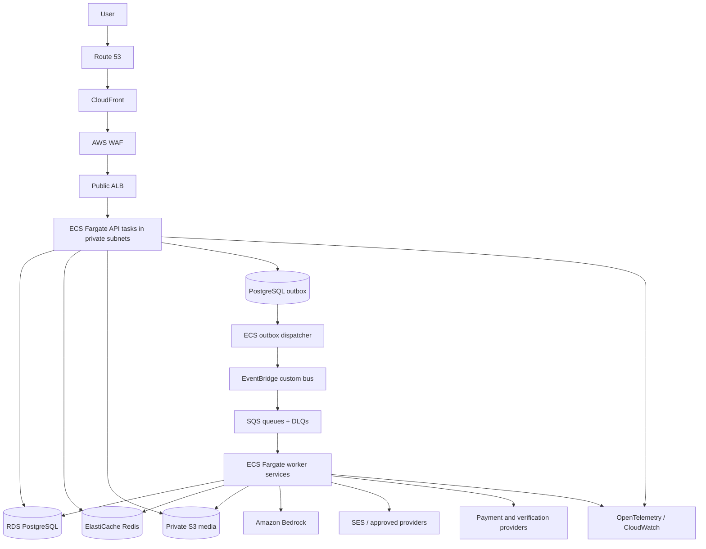

# AWS infrastructure and CI/CD

## 1. Goals

- Deploy the same tested container artifacts used locally/CI.
- Keep the API simple and continuously available while scaling AI, media, notification, and operational workers independently.
- Use managed AWS services for durability, security, and low operational burden.
- Provision everything reproducibly through Terraform.
- Give humans and GitHub short-lived role access—not long-lived “service account” keys.
- Start cost-conscious for 1,000 users without creating a dead-end architecture.

## 2. Environment and account model

Recommended:

| Environment | AWS isolation | Data policy | Deployment |
|---|---|---|---|
| Local | No AWS required | Synthetic only | Developer machine |
| Development | Separate non-production AWS account | Synthetic/de-identified test only | Automatic from main after checks |
| Staging | Non-production account, isolated VPC/resources | Synthetic and approved provider sandboxes | Promote immutable release candidate |
| Production | Separate production AWS account | Real user data | Manual approval plus protected GitHub environment |

A small team may temporarily share development/staging account while keeping distinct VPCs, KMS keys, IAM roles, databases, buckets, queues, and secrets. Production must not share credentials or data with non-production.

Select the primary region only after reviewing launch-user residency, latency, Bedrock model availability, provider integration, service availability, and cost. Parameterize region; never embed it in domain code.

## 3. AWS topology



### Network

- VPC spans at least two availability zones.
- ALB is public; ECS API/worker tasks, RDS, and Redis are private.
- Security groups reference other security groups, not broad CIDRs.
- RDS accepts only application/migration/approved admin paths. Redis accepts only relevant ECS tasks.
- NAT gateway count is an explicit availability/cost decision. Add VPC endpoints for S3, ECR, CloudWatch, Secrets Manager, SQS, EventBridge, and Bedrock where supported and justified.
- No public IP on ECS tasks, RDS, or Redis.

### Edge

- Route 53 hosted zones and ACM certificates.
- CloudFront for TLS edge, static/later frontend, safe public content, and controlled routing to ALB.
- AWS WAF managed rules, rate-based rules, bot/scraping protections tuned to avoid blocking legitimate users.
- Private API/profile/media responses are not cached. Use origin-request policy that avoids forwarding unnecessary cookies/headers.
- S3 origins use origin access control; buckets block all public access.

## 4. Compute

### ECS services

- `api`: NestJS REST/WebSocket service behind ALB. Production starts with two tasks across AZs when budget permits; target-tracking autoscaling on CPU/memory/request metrics.
- `outbox-dispatcher`: claims PostgreSQL outbox and publishes EventBridge events.
- `scheduler`: claims due jobs and enqueues SQS work.
- `worker-profile-projection`.
- `worker-media`.
- `worker-ai-profile`.
- `worker-ai-match`.
- `worker-ai-communication`.
- `worker-notification`.
- `worker-safety`.
- `worker-verification`.
- `worker-billing`.
- `worker-analytics`.
- `worker-compliance` runs only with its dedicated privileged role and controlled desired count/schedule.

At initial scale, low-volume logical workers may share one ECS service if they have the same IAM/data/concurrency boundary. Keep separate queues and code handlers so they can split without redesign.

### Container hardening

- One multi-stage build, minimal pinned non-root runtime image, read-only root filesystem where compatible, explicit temporary volume, dropped capabilities.
- Immutable image digest promoted between environments; do not rebuild for production.
- API and worker use the same code version during ordinary deployments; event versioning allows safe rolling windows.
- Health/readiness endpoints, graceful shutdown, deployment circuit breaker, and minimum healthy percentage configured.
- ECS Exec disabled by default in production or tightly role/audit controlled.

## 5. Data services

### RDS PostgreSQL

- Managed PostgreSQL version matching local major version.
- Private subnet group, encryption with environment KMS key, TLS required.
- Production Multi-AZ, automated backups and point-in-time recovery, deletion protection, maintenance window, storage autoscaling, performance insights/slow-query monitoring as approved.
- Separate credentials/roles for application, migrations, read-only operations, and analytics. Store in Secrets Manager and rotate with tested process.
- RDS Proxy is not required initially; add only if connection churn/scaling warrants it. Application pools have explicit budgets below DB maximum.
- Staging regularly restores a production-like synthetic/scrubbed snapshot or backup to test migrations—not raw production data unless a governed process exists.

### ElastiCache Redis

- Private, encrypted in transit/at rest, authentication enabled, no public endpoint.
- Cache/rate-limit/realtime state is disposable; core correctness does not rely on it.
- Production replication/failover decision is based on accepted degradation behavior and budget.
- Memory, eviction, connection, latency, and failover alarms.

### S3

Separate logical buckets or tightly isolated prefixes for:

- media originals/quarantine;
- processed profile media;
- restricted verification/moderation evidence;
- generated biodata/data exports;
- logs/artifacts as required.

Enable public access block, ownership enforcement, encryption, lifecycle, incomplete multipart cleanup, versioning where recovery requires it, restricted bucket policies, and access/data-event audit for evidence. Use different KMS keys/roles for restricted evidence. Short-lived signed access follows application authorization.

## 6. Events and queues

- One custom EventBridge bus per environment.
- Source/type rules route versioned events to standard SQS queues; use FIFO only for measured strict-order cases.
- Every queue has KMS encryption, redrive policy, DLQ, long polling, appropriate visibility timeout, retention, and oldest-age/DLQ alarms.
- Queue policy permits only approved EventBridge rule/producer role.
- Worker task role receives only its queues, table/provider/storage scope, and model actions.
- Event archive/replay is optional; if enabled, review PII minimization and retention first. DLQ selective replay tooling remains required.

## 7. AI and external providers

### Bedrock

- ECS AI worker task roles invoke only approved foundation model/profile resources in approved region(s).
- Model aliases and prompt versions are application configuration; provider credentials are IAM role based.
- Validate service quotas and request increases before beta load tests.
- Alarms cover throttling, model errors, latency, queue age, and application-calculated spend/tokens.
- Bedrock invocation logging is disabled or configured to a tightly restricted encrypted destination only after privacy review.

### Notifications

- SES for transactional email is the AWS default candidate; complete domain identity, DKIM/SPF/DMARC, sandbox exit, bounce/complaint handling, suppression, and templates.
- SMS may use SNS/Pinpoint or an approved regional provider after sender/consent/cost review.
- WhatsApp requires an approved provider/business account and explicit template/consent handling.
- Provider secrets and webhook signing values live in Secrets Manager.

### Payments and verification

- Use hosted checkout/provider SDK through adapters; LaaraLaari does not receive card details.
- Webhooks terminate at ALB/API, verify raw body/signature, durably capture, and enqueue processing.
- Provider egress may use NAT/allowlisted endpoints; never accept provider metadata as authorization.
- Sandbox credentials are separate from production and scoped to environment.

## 8. Terraform structure

```text
infra/terraform/
  modules/
    account-baseline/
    network/
    dns-edge/
    ecs-cluster/
    ecs-service/
    rds-postgres/
    elasticache/
    object-storage/
    eventbridge-sqs/
    observability/
    iam-oidc/
    secrets-contract/
    budgets/
  environments/
    dev/
    staging/
    prod/
```

Rules:

- Remote encrypted state in a dedicated S3 bucket with locking mechanism, versioning, access logs, and narrow roles. Terraform state is sensitive.
- Environment code composes modules with reviewed variables; no copied unmanaged console resources.
- Secrets are created/referenced by Terraform but secret values are injected separately and never stored in source/state where avoidable.
- Checkov/tfsec-equivalent and Terraform validate/format/plan run in CI.
- Plans are attached to protected environment approvals; apply uses a different role from plan where practical.
- Tag every resource with application, environment, owner, data classification, cost center, and managed-by.
- Detect drift on a schedule. Emergency console change requires incident/change record and reconciliation into Terraform.

## 9. IAM and AWS access handoff

Do not send an AWS access key or secret key through chat.

Set up:

1. AWS Organizations/accounts and IAM Identity Center for human access.
2. Named permission sets for developer-read, deploy-nonprod, deploy-prod-approver, database-operator, security-audit, and incident emergency access.
3. GitHub OIDC provider with claims restricted to the exact organization/repository/branch or protected environment.
4. Environment-specific GitHub roles: CI read/test, Terraform plan, Terraform apply, ECR publish, ECS deploy, and migration task as narrowly as practical.
5. ECS task roles by API/worker responsibility; never share the deploy role with runtime.
6. CloudTrail and alerts for role changes, denied spikes, root use, access-key creation, KMS/Secrets Manager/restricted-S3 access.
7. Root account protected by hardware MFA and no routine use.

The user can grant a short-lived SSO role or authorize creation of OIDC roles during the cloud milestone. Long-lived service-user credentials are neither needed nor accepted.

## 10. Git and branch/release strategy

- Initialize a private repository with protected `main`, required pull requests/checks, CODEOWNERS for infrastructure/security/migrations/contracts, secret scanning, and dependency updates.
- Trunk-based flow with short-lived branches. Every merge to `main` is releasable.
- Conventional or otherwise machine-readable change notes connect commits to backlog IDs.
- Releases are immutable Git tags plus image digest, SBOM, provenance, migration set, OpenAPI/event schema version, and AI prompt/evaluation summary.
- No production secrets/data/provider exports/build artifacts are committed.

## 11. CI pipeline

### Pull request

1. Check branch/source permissions and dependency changes.
2. Install with frozen lockfile and cached package store.
3. Verify format, lint, strict types, architecture constraints, generated OpenAPI/events.
4. Start ephemeral services; apply migrations from empty and upgrade fixture.
5. Run unit, integration, contract, backend E2E, authorization, and fake-AI evaluations.
6. Run secret, SAST, dependency/license, container, and Terraform/IaC scans.
7. Build the production container reproducibly; generate SBOM and provenance.
8. Terraform validate and plan non-production changes without applying.

Pull requests from forks never receive secrets or cloud role permissions.

### Main/development deployment

1. Repeat/verify required checks.
2. Build once, scan, sign/attest, and push ECR image tagged by commit; capture immutable digest.
3. Apply approved development infrastructure change through OIDC role.
4. Run migration as a one-off ECS task using the migration role and same image digest.
5. Deploy ECS services using image digest and deployment circuit breaker.
6. Run health, smoke, contract, event-adapter, and backend E2E subset.
7. Run changed AI capabilities against approved Bedrock development route and publish safe evaluation summary.
8. Mark release candidate only if all gates pass.

### Staging promotion

- Promote the exact image digest and versioned configuration—do not rebuild.
- Apply expand-compatible migrations first.
- Deploy with production-like topology/roles/queues, synthetic data, and provider sandboxes.
- Run complete E2E, DAST/API security, migration, load smoke, queue retry/DLQ, rollback, backup/restore, and observability checks.
- Product/security review AI evaluation changes and open decision dependencies.

### Production promotion

- Protected GitHub environment requires designated approval.
- Show image digest, changelog/backlog IDs, migration risk, Terraform plan, security results, AI evaluation, rollback plan, and current alarms.
- Apply infrastructure and expand migrations through separate production roles.
- Deploy rolling/canary according to risk. Start small, observe health/error/latency/business invariants, then complete.
- Run read-only/synthetic smoke checks; never create misleading public profiles.
- Automatically rollback application tasks on health/alarm failure. Database rollback follows migration-specific forward-fix/compatibility plan.
- Create deployment audit record and monitor heightened window.

## 12. Migration deployment rules

- Migrations are backward compatible with current and next application versions.
- Sequence: expand schema → deploy compatible code → asynchronous backfill with checkpoints → verify → later remove old reads/writes → contract schema in a separate release.
- A one-off migration ECS task holds a PostgreSQL advisory lock so only one runner proceeds.
- Set statement/lock timeouts; large index builds use PostgreSQL online/concurrent technique where valid.
- Backup/PITR is confirmed before high-risk change. Staging tests the production-size estimate.
- Rolling back an image must work against the expanded schema. Never rely on automatic destructive down migrations in production.

## 13. Observability

### Signals

- API: traffic, p50/p95/p99 latency, status/domain-code rates, auth/rate-limit outcomes, WebSocket connections.
- PostgreSQL: connections, CPU, storage, IOPS, locks, replication/failover, slow queries, migration duration.
- Redis: memory, eviction, connection, latency, errors.
- Outbox/queues: unpublished count/oldest age, depth, oldest message, processing latency, retries, DLQ.
- Workers/providers: throughput, success/error classification, timeout/throttle, provider latency.
- AI: capability/route/prompt success, schema/grounding/safety/stale/fallback, tokens and cost.
- Product/safety: onboarding/publish/interest/match/message funnels, report rate, moderation SLA—aggregated without sensitive labels.
- Billing: webhook lag, reconciliation mismatch, payment state failures; no card data.

### Alerting

Alerts are actionable and map to runbooks. Page for availability, sustained error/latency, DB capacity/failover, old outbox, critical queue/DLQ, billing drift, restricted access anomalies, secret/KMS failures, and runaway AI spend. Ticket lower-severity trends. Test alarms in staging.

Logs are structured/redacted with environment-specific retention. Use CloudWatch initially; OpenTelemetry preserves future backend portability.

## 14. Backup, restore, and disaster recovery

- RDS automated backups/PITR with production retention approved; copy snapshots cross-account/region if RPO/risk requires.
- S3 versioning/lifecycle/object recovery based on bucket class; replication only after residency/cost review.
- Terraform state versioned and recoverable; secrets/KMS policies documented.
- Redis is not system of record; rebuild caches/rate state after loss.
- Event/job recovery uses outbox, SQS retention, DLQ, and selective replay.
- Quarterly initial restore exercise: create isolated environment, restore DB/objects/config, deploy pinned image, run integrity and journey checks, record actual RPO/RTO.
- Initial targets: RPO 15 minutes or better and RTO 4 hours or better, validated rather than assumed.
- Region-wide DR is a later cost/requirement decision; IaC and backups must avoid preventing it.

## 15. Cost controls for 1,000 users

- AWS Budgets and Cost Anomaly Detection per environment/service/tag from the first deployed resource.
- Non-production schedules may scale ECS workers/API down when unused; never stop resources required for automated tests without clear wake-up behavior.
- Worker autoscaling can reach zero only if startup delay meets queue/user expectations.
- Use Fargate sizing from measured CPU/memory, RDS Graviton/burstable class where supported and tested, and S3 lifecycle cleanup.
- AI per-capability quotas, token/output bounds, dedupe/cache, route tiers, concurrency, and spend kill switches.
- Control log/trace retention and high-cardinality metrics.
- Compare NAT gateway versus VPC endpoint costs for the chosen region/traffic; do not guess.
- Produce an AWS Pricing Calculator estimate after region/topology/provider choices and review estimated versus actual monthly spend.

Do not sacrifice production backups, encryption, private database access, audit, or basic redundancy solely to reduce the first bill.

## 16. Cloud release gate

- Terraform recreates development/staging from documented inputs with no unmanaged required resource.
- GitHub OIDC, SSO, least-privilege deploy/task roles, secret injection, and audit alerts work; no long-lived key is present.
- Image digest/SBOM/provenance and scans pass; production runs the tested digest.
- Private networking, TLS, WAF, S3 public block, encryption, RDS backups/PITR, and deletion protection are verified.
- Migrations, rolling/canary deployment, application rollback, selective DLQ replay, and provider reconciliation are rehearsed.
- Bedrock contract/evaluation, quotas, fallbacks, cost alarms, and kill switches pass.
- Monitoring dashboards/alerts/runbooks and on-call ownership exist.
- Backup restore meets measured RPO/RTO target.
- Staging backend journey and security/load gates pass.
- Production domains, legal content, moderation/support coverage, and launch decision dependencies are approved.
